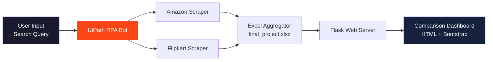
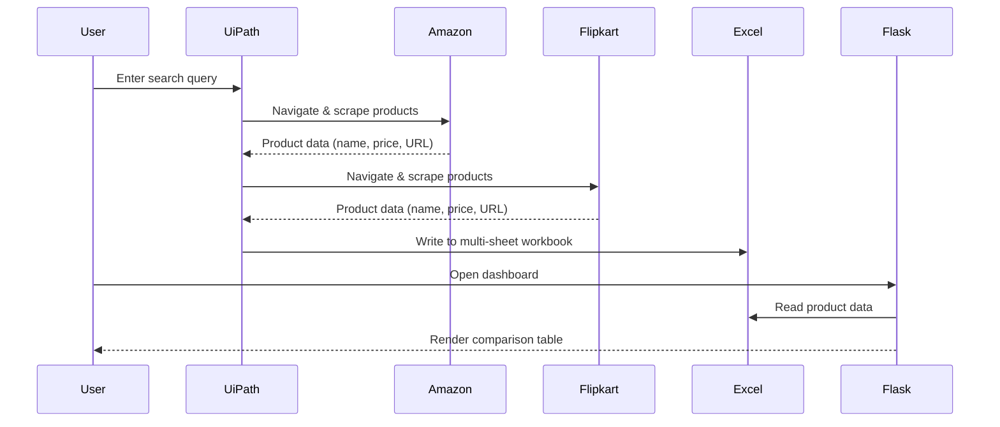

<div align="center">

# 🛒 ShoppingRobot — RPA-Powered Price Comparison Engine

**Automated web scraping and price comparison across Amazon & Flipkart using UiPath + Flask**

[](https://python.org)
[](https://flask.palletsprojects.com/)
[](https://www.uipath.com/)
[](https://pandas.pydata.org/)
[](LICENSE)

</div>

---

## 📌 Problem Statement

Manually comparing product prices across multiple e-commerce platforms is time-consuming and error-prone. **ShoppingRobot** automates this process using **Robotic Process Automation (RPA)** to scrape product data from Amazon and Flipkart, aggregate it into a structured format, and display a side-by-side comparison through a clean web interface.

---

## 🧠 System Architecture



---

## ✨ Key Features

- 🤖 **RPA Automation** — UiPath bot navigates Amazon & Flipkart like a human user
- 📊 **Price Comparison** — Side-by-side product comparison with direct purchase links
- 📁 **Excel Export** — Structured data stored in multi-sheet Excel workbooks
- 🌐 **Web Dashboard** — Flask-powered responsive comparison interface
- 🔗 **Clickable URLs** — Direct links to product pages for instant purchasing

---

## 🛠️ Tech Stack

| Component | Technology | Purpose |
|-----------|-----------|---------|
| **RPA Engine** | UiPath Studio | Browser automation & web scraping |
| **Backend** | Python + Flask | Web server & data processing |
| **Data Processing** | Pandas + openpyxl | Excel read/write & data manipulation |
| **Frontend** | HTML + Bootstrap | Responsive comparison dashboard |
| **Data Store** | Excel (.xlsx) | Multi-sheet product data storage |

---

## 🚀 Quick Start

### Prerequisites

- [UiPath Studio](https://www.uipath.com/studio) installed and configured
- Python 3.8+ with pip
- Google Chrome (for RPA browser automation)

### Setup

```bash
# 1. Clone the repository
git clone https://github.com/coolss21/ShoppingRobot.git
cd ShoppingRobot

# 2. Install Python dependencies
pip install flask pandas openpyxl

# 3. Place the ShoppingRobot folder in C:\ drive
#    (Required for UiPath file path references)

# 4. Open ShoppingRobot/Main.xaml in UiPath Studio
#    Run the build to execute the RPA workflow

# 5. After scraping completes, start the Flask dashboard
cd ShoppingRobot
python app.py
# Dashboard available at http://localhost:5000
```

---

## 📂 Project Structure

```
ShoppingRobot/
├── ShoppingRobot/
│   ├── Main.xaml              # UiPath main workflow
│   ├── app.py                 # Flask web server
│   ├── final_project.xlsx     # Scraped product data
│   ├── project.json           # UiPath project config
│   └── templates/
│       └── index.html         # Comparison dashboard template
├── documentation              # Setup instructions
└── README.md                  # This file
```

---

## 🔄 Workflow



---

## 🧪 Usage

1. **Run the RPA Bot** — Open `Main.xaml` in UiPath Studio and execute
2. **Enter Search Term** — The bot will prompt for a product to search
3. **Wait for Scraping** — The bot navigates both platforms and extracts data
4. **View Results** — Launch the Flask app and browse the comparison dashboard

---

## 📄 License

This project is licensed under the [MIT License](LICENSE).

<div align="center">
  <br/>
  <p><i>Smart shopping starts with smart automation.</i></p>
</div>
